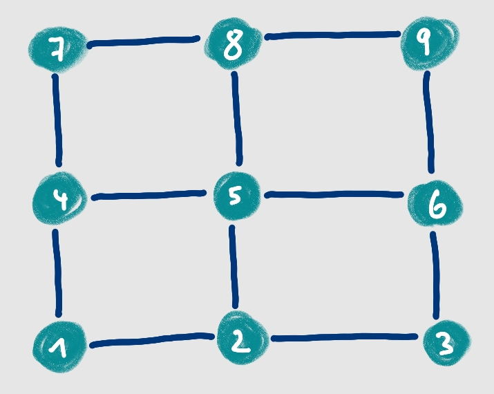
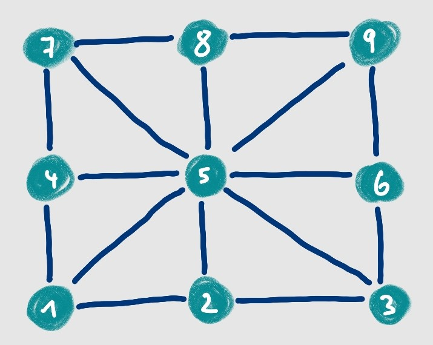
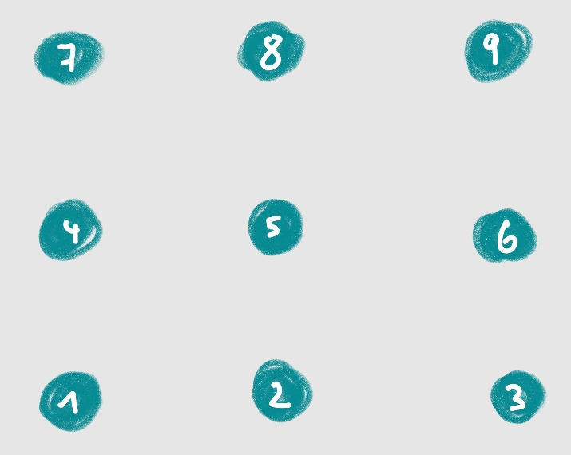
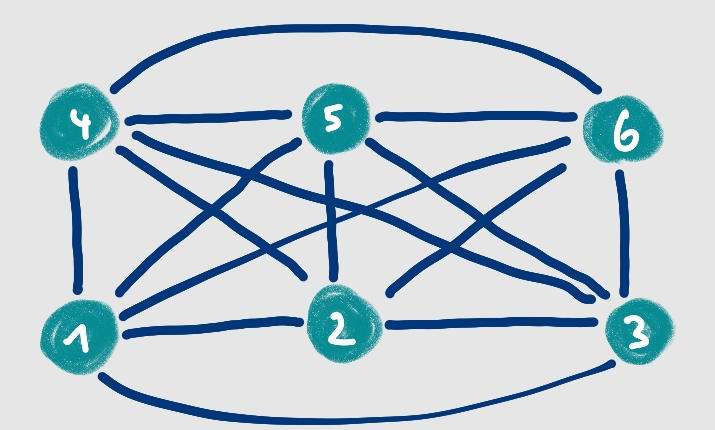
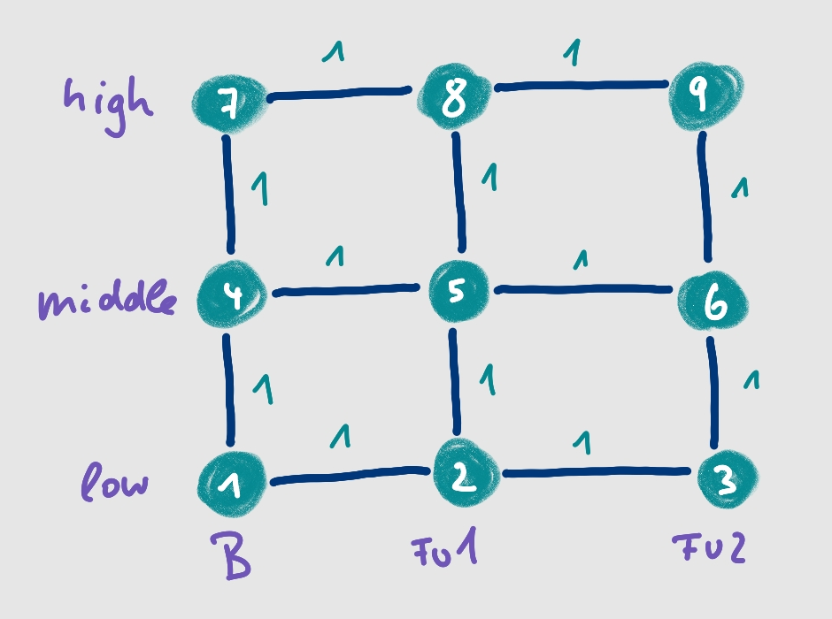
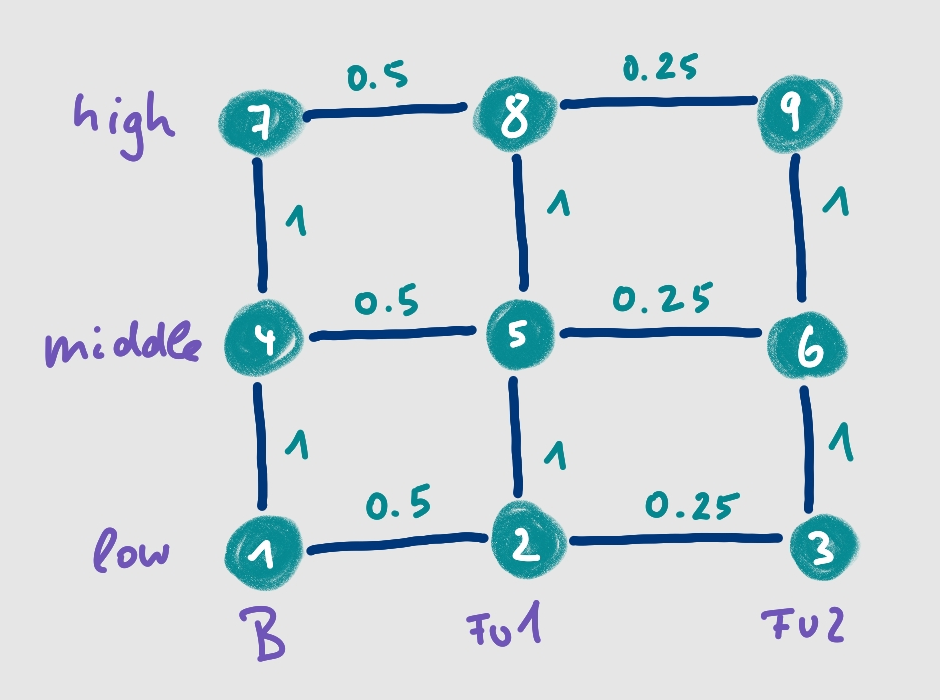

```{r, include = FALSE}
knitr::opts_chunk$set(
  collapse = TRUE,
  comment = "#>",
  fig.width = 8,   # Adjust this to match the text width
  fig.height = 5  # Maintain a good aspect ratio
)
```

<!-- devtools::build_rmd("vignettes/cvn-vignette.Rmd") -->


# Introduction

CVN is a package that provides an efficient algorithm for estimating covariate-varying networks by 
[https://arxiv.org/abs/2407.19978](Dijkstra, Godt and Foraita (2024)).
This vignette describes the basic use of CVN in R. 


Graphical models are powerful tools for exploring complex dependency structures in high-throughput biomedical datasets, such as genomics, epigenomics, and proteomics. They allow for the investigation of biologically meaningful patterns that aid in understanding biological processes and generating new hypotheses. Despite the widespread application of Gaussian graphical models, there was an urgent need connecting graph structures to external covariates. 

CVN are graphical models for high-dimensional data
that can change by multiple external **discrete** covariates.
For each combination of the categories between the covariates, a graph is estimated. 
This is not done individually, since we allow for similarities between different graphs 
related to various covariates. The smoothness between the graphs in the CVN model is 
introduced by a meta-graph $W$. In this meta-graph, each node corresponds 
to a graph in the CVN model. 


<!-- {width=50%} -->


<!-- {width=50%} -->


<!-- {width=50%} -->

<!-- {width=50%} -->


<div style="display: flex;">
  
  <span>*Meta-graph of dimension $3 \times 3$ representing a grid*</span>
</div>


<div style="display: flex;">
  
  <span>*Another meta-graph*</span>
</div>


<div style="display: flex;">
  
  <span>*A glasso-type meta-graph that excludes smoothing*</span>
</div>


<div style="display: flex;">
  
  <span>*A full meta-graph of dimension $3 \times 2$*</span>
</div>


Covariate-varying networks are high-dimensional dynamic graphical models that vary 
with multiple external covariates. The methodology is explained in detail
in the pre-print by [Dijkstra, Godt and Foraita (2024)](https://arxiv.org/abs/2407.19978).
In this vignette we describe how to apply the method to data with the associated
R package `CVN`.

A CVN is represented as graphical model with the quintupel 

$$
\text{CVN} = \{\mathbf{X}, \mathbf{U}, \mathcal{U}, f(\mathbf{X} \mid \mathbf{U}), 
\{G(u) = (V, E(u)) \}_{u \in \mathcal{U}} \},
$$
where $\mathbf{X} = (X_1, X_2 \ldots, X_p)^\top$ is a $p$-dimensional random vector and 
$\mathbf{U} = (U_1, U_2, \ldots, U_q)^\top$ is a random vector representing $q$ 
external discrete covariates. The external covariates are not included in the graph. 
These covariates have $(K_1,\ldots, K_q)^\top$ categories.

The vector $\mathbf{U}$ lies in the discrete space $\mathcal{U}$ with cardinality 
$m \leq \prod_{k=1}^q K_k$. The joint density function of $\mathbf{X}$ conditioned on 
$\mathbf{U}$ is $f(\mathbf{X} \mid \mathbf{U})$. 
The fifth element of the CVN is a set of $m$ graphs, one for each value $u$ in $\mathcal{U}$. 
The vertices of $G(u)$, $V = \{1, 2, \ldots, p\}$, correspond to the variables 
$X_1, X_2, \ldots, X_p$ and do not change with $\mathbf{U}$. 

We assume that $\mathbf{X} \mid \mathbf{U}$ follows a multivariate normal distribution
with $\mathbf{\mu}(u) = 0$ and covariance matrix $\mathbf{\Sigma}(u)$. 
To estimate the structure of the graph, we focus on the precision matrix 
$\mathbf{\Theta}(u) = \mathbf{\Sigma}(u)^{-1}$ which has the following property 
under the normality assumption:

$$
\theta_{ij}(u) = 0 \Leftrightarrow 
X_i \not\!\perp\!\!\!\perp X_j \mid \mathbf{X}_{V \setminus \{i,j\}} \land U = u  
\Leftrightarrow 
\text{edge } \{i,j\} \notin E(u)
$$
Hence, the (in)dependence structure of the CVN can be estimated by determining the zero entries of 
the precision matrices.
Our goal is to enable a CVN to handle high-dimensional data and identify structural similarities between graphs. Therefore, we define the CVN estimator of $\mathbf{ \Theta}_{\text{CVN}} = \{ \widehat{\mathbf{\Theta}}_i \}_{i = 1}^m$ 
as follows

$$ \mathbf{ \Theta}_{\text{CVN}} = \text{argmin}_{\{ \mathbf{\Theta}_{i}\}_{i = 1}^m} 
	\Bigg[ \sum_{i = 1}^m \ell\left({\mathbf{\Theta}_i}\right) 
	 + \lambda_1 \sum_{i = 1}^m \left\rVert \mathbf{\Theta}_i \right\rVert_1 
	 + \lambda_2 \sum_{i < j} w_{ij} \left\lVert \mathbf{\Theta}_i - \mathbf{\Theta}_j \right\rVert_1 \Bigg],$$


where $\mathbf{ \Theta}_i$ is the $i$-th precision matrix, $\ell\left({\mathbf{\Theta}_i}\right)$ the log-likelihood function for precision matrix $i$, $w_{ij}$ values of the symmetric
weighted adjacency matrix of the meta-graph (see below) and $\lambda_1, \lambda_2$ are
two tuning parameters. 


## Data

The input of a CVN is a list of $m$ data sets. The number of variables $p$ must be 
equal in each list element, the number of observations may differ.

Suppose you have two external variables $U_1$ and $U_2$, each having $K = L = 3$ categories. 
The input of a CVN is then a list of $K \cdot L = m$ data sets. 
The number of variables $p$ must be equal in each list element, the number of observations may differ.


In this example we will use a simulated data set where the variables can be thought of
to be z-score values of various biomarkers, each following a normal distribution. We 
are interested how the graphs differ by two external variables, as for example
'survey' and 'income level'. Each external variable has three categories (*baseline*, 
*first follow up*, *second follow up* for 'survey' and *low*, *middle* and *high* 'income levels').

We used the `CVNSim` package
([https://github.com/bips-hb/CVNSim](https://github.com/bips-hb/CVNSim))
to simulate this data set. 

The data to be included in the CVN must be provided as a list. Each element of the list 
should be a matrix of the Gaussian data corresponding to each combination of the two 
external variables categories. In this case, the list contains 9 elements 
(*baseline - low income*, *baseline - middle income*, ...,
*second follow up - high income*).


```{r data, warning=FALSE}
# Load required library
library(CVN)
library(dplyr)

# Load data: a list of 9 data sets with p variables an n_i observations.
# data(grid)
# m <- length(grid)

# Simulate the dataset
set.seed(2024)  
n <- 300  

# Create 10 normally distributed variables for the graph
data <- as.data.frame(matrix(rnorm(n * 10), ncol = 10))
colnames(data) <- paste0("X", 1:10)

# Add two discrete external covariates
data$dosis <- sample(1:3, n, replace = TRUE)  
data$bmi <- sample(c("normal", "overweight"), n, replace = TRUE)

# Split the dataset into subsets based on dosis and bmi
data_list <- data %>%
  group_by(dosis, bmi) %>%
  group_split() %>%
  lapply(function(df) df %>% select(-dosis, -bmi))

names(data_list) <- apply(expand.grid(dosis = 1:3, bmi = c("normal", "overweight")), 1, 
                               function(x) paste0("dosis_", x[1], "_", x[2]))

```


## Weigth matrix
As described above, a CVN graphical model introduces smoothness between the graphs 
by a *meta-graph* $W$ that needs to be specified a priori.

The meta-graph is a $m \times m$ symmetric weight matrix which reflects an 
undirected graph.  In our example, it could look like this:


{width=50%}


The figure shows an unweighted grid of a $3 \times 3$ meta-graph.
We have also the possibility to weight the grid, for example like this:

{width=50%}


The function `create_weight_matrix` can create an unweighted matrix reflecting a
meta-graph for two covariates, each having 3 categories. 

** picture of the three meta-graphs **

The weight matrix is a $m \times m$ symmetric matrix. It reflects the *meta-graph* which
encodes the smoothing structure between the graphs. A weight of 0 does not smooth 
the structure between two graphs. Weights must be chosen between 0 and 1.  

In case of two external covariates, the weight matrix 
can be generated using a simple function. 

```{r W}
W_full <- create_weight_matrix("full", k = 3, l = 2)  
# plots can be turned on by setting plot = TRUE. You need the igraph package for this
W_grid <- create_weight_matrix("grid", k = 3, l = 3, plot = TRUE)
W_gl   <- create_weight_matrix("glasso", k = 3, l = 2)
W_random <- round(create_weight_matrix("uniform-random", k = 4, l = 3), 2)
```

Weight matrices can be plotted as a grid graph or as a heatmap:
```{r W-heat}
plot_weight_matrix(W_random, k = 4, l = 3)
hd_weight_matrix(W_random)  # randomly chosen weights
```


## Tuning parameter space
As know from the LASSO, we also have to choose a tuning parameter from the 
regularization path. The choice of the tuning parameters affects how dense the graphs are and how much the edges between the graphs have been smoothed. 
CVN model can fit all combinations of a given 
selection of $\lambda_1$ values for controlling sparsity and $\lambda_2$ values
for controlling smoothness between the covariates categories accordingly to the 
defined meta-graph.

A CVN requires to select two tuning parameters which control the regularization applied
to the CVN. These parameters are usually searched for in a predetermined regularization path.
$\lambda_1$ introduces sparsity in the CVN, which gets sparser the larger $\lambda_1$ is 
chosen. $\lambda_2$ penalizes differences between the precision matrices that are 
connected in the meta-graph. It encourages similar values in the precision
matrices and hence also if an edge is included in the graph or not. The graphs in the CVN
are getting more and more similar the larger $\lambda_2$ is selected. 

```{r tp}
# Lets choose a regularization path for each tuning parameter
lambda1 = seq(0.5, 2, length = 3)  # sparsity
lambda2 = c(1, 1.5)                # smoothing
```


## Estimate a CVN
The CVN graphical model is fitted by an alternating direction method of 
multipliers (ADMM). The default is to perform parallel computing, but it can be switched off by setting `ncores = 1`.


```{r cvn, eval=TRUE}
cvn <- CVN(data = grid, 
              W = W_grid, 
        lambda1 = lambda1, 
        lambda2 = lambda2, 
            eps = 1e-2, 
        maxiter = 500, 
        n_cores = 1,
      warmstart = TRUE,   
        verbose = FALSE)

# Print results
print(cvn)
```

## Selecting tuning parameters

After fitting the CVN model, the next step involves selecting suitable values for the 
tuning parameters $\lambda_1$ and $\lambda_2$. The first governs the sparsity of the graphs, 
and the second is responsible for regulating the smoothness or similarity between the graphs.

The CVN package derives the Akaike Information Criteria (AIC) and the Bayesian Information
Criteria (BIC). Our simulations showed better results in detecting the true underlying
graph for AIC than for BIC. Both information criteria are returned in the CVN result table.


```{r aicbic, eval=TRUE}
best.aic <- cvn$results[which.min(cvn$results$aic), "id"]
cvn$results[best.aic,]
```

The package contains also an option of plotting the results of the information
criteria. The plot is a map of all IC values for every tuning parameter combination
fitted by CVN. 

The smaller the IC value, the better the fit. 
The yellow dot denotes the tuning parameter combination 
which shows the smallest IC value.


```{r icplot, eval=TRUE, fig.width=10, out.width='100%'}
plot_information_criterion(cvn, criterion = "aic", use_gammas = FALSE)
```


## Network plots

The $m$ fitted graphs can be plotted by the plot function.
If you only want to return the plot of one tuning parameter 
combination, you can do it as shown below. 

```{r pp, eval=TRUE}
plot_cvn <- plot(cvn)

# return plots for the best AIC value
plot_cvn$plots[[best.aic]][[1]]
```

To investigate the differences between the graphs, it is advisable to look at the 
Hamming distance between the $m$ fitted graphs. 
You have the option to get the result as a matrix or as a heatmap.
The numbers in each cell reflect the number of different edges between two graphs. 

```{r hamming, eval=TRUE, out.width='100%', fig.width=10}
(hd <- hamming_distance_adj_matrices(cvn$adj_matrices[[best.aic]]))

# All Hamming distances
plot_hamming_distances(hd)
```

The CVN is simply estimated by the following. It will parallelize by default if there are
more than one $\lambda_1$ or $\lambda_2$ values.  


It is also possible to change the $\gamma$-value for the eBIC. The default is $\gamma = 0.5$.


```{r ebic}
(dic <- determine_information_criterion_cvn(cvn, gamma = 0.9))

cat("minimal AIC: ", which.min(cvn$res$aic))  
cat("\nminimal BIC: ", which.min(cvn$res$bic))  
cat("\nminimal eBIC with gamma = 0.5: ", which.min(cvn$res$ebic))
cat("\nminimal eBIC with gamma = 0.9: ", which.min(dic[3,]))  
```
Based on the information criteria, it is unclear which graph to choose. The AIC 
selects slightly denser models than the BIC. Our simulation study showed that 
AIC tends to perform better than BIC in general, 
but all perform rather poorly in practice.

The package also includes a plot function to check if the regularization path is too small.
The yellow dot shows the tuning parameter constellation that minimizes the BIC. 
If this point is on the limit, you should think about to choose different tuning parameters.

```{r plotIC}
plot_information_criterion(cvn, use_gammas = FALSE, criterion = "bic")
```


## An alternative tuning parameterization
In our manuscript, we also introduced an alternative tuning parameterization. 
Due to the algorithm's computational complexity, performing an exhaustive naive search across a broad range of potential values is usually not feasible. We realized that introducing a different external covariate, thereby altering the number of graphs $m$, or considering different variables, which changes $p$, impacts the interpretation and meaning of the tuning parameters $\lambda_1$ and $\lambda_2$. In other words, if one selects optimal values for $\lambda_1$ and $\lambda_2$ and then slightly alters the dataset, these values may no longer be informative for the new dataset.

To address this issue, we propose a new parameterization, denoted as $\gamma_1$ and $\gamma_2$, replacing $\lambda_1$ and $\lambda_2$. Unlike the previous tuning parameters that penalize the entire precision matrix and differences between precision matrices, $\gamma_1$ and $\gamma_2$ are used to penalize individual edges and edge pairs. 

This alternative tuning parameterization remains robust when changing the number of variables or graphs in the CVN model. This new parameterization could be beneficial for other applications as well.

The results table of the CVN model includes the gamma tuning parameters by default. 


BLUBBBLUBBLUBBLUBB

In the following, however, we want to investigate the CVN with id = 6. 
It is easier to extract that CVN into a new object.

```{r extract}
fit3 <- extract_cvn(cvn, 3)
fit6 <- extract_cvn(cvn, 6)
```


# Plot a CVN model
The graphs can be plotted with a print function that relies on the `visnet`package.

```{r pp2, eval=FALSE}

plot_cvn <- visnetwork_cvn(fit6, verbose = FALSE)
## DER CORE GRAPH WIRD FALSCH GEFÄRBT
```


Differences between the graphs can be investigated looking at the number of edges in each
CVN subgraph and by investigating the Hamming distances between the subgraphs. 


```{r hamming2, eval=FALSE}
# Shows the number of edges in each subgraph, the number of edges that are shared by 
# all graphs (core) and the number of edges that are unique for each subgraph
cvn_edge_summary(cvn)

# Hamming distance matrix and plot
hd_matrix <- hamming_distance_adj_matrices(fit3$adj_matrices[[1]]) 
plot_hamming_distances(hd_matrix)

# or directly
# plot_hamming_distances_cvn(fit3)

```


## Interpolation
We have also proposed a method to interpolate a graph for which we do not have collected data. This can be done using an estimated CVN model based on $m$ graphs. Let $G_{m+1}$
represent the graph we want to interpolate.

We need to set a vector of smoothing coefficients that determine the amount of smoothing between the new graph and the $m$ older graphs. 


```{r interpolate, eval=TRUE}
cvn2 <- interpolate(cvn, c(0.1,0.5,1,0.1,0.1,0.5,0.1,0.1,0.1))
cvn2$adj_matrices[[best.aic]]
```

Note that with this approach, it is difficult to control the level of sparsity and take different levels of similarity between the graphs into account.


BLUBBBLUBBLUBBLUBB


# Interpolate graph based an previously fitted CVN model

Suppose we have graphs for 3 time points and we want to interpolate the graph for
the 4th time point based on a previously fitted model. We can do this as follows.


```{r interpolate2}
set.seed(86)
time_data <- lapply(1:3, function(x) matrix(rnorm(500), ncol = 5))
W <- create_weight_matrix("grid", 3, 1)
timefit <- CVN(time_data, W, maxiter = 1000,
               lambda1 = 6, lambda2 = .5, verbose = FALSE)

timefit$adj_matrices
timefit4 <- interpolate(timefit, c(0,0.25,1), truncate = 1e-02)
timefit4$adj_matrices
```
The function is still work in progress and applying it to real data requires more experience. 
We also did not investigate its performance in simulation study. 
It should therefore be used with caution.  

