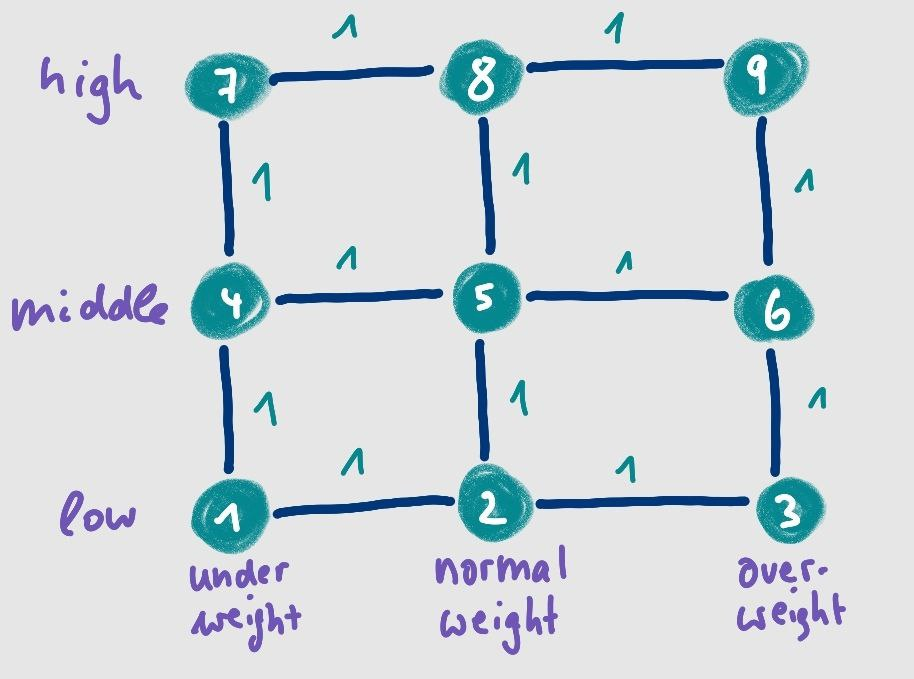

```{r, include = FALSE}
knitr::opts_chunk$set(
  collapse = TRUE,
  comment = "#>",
  fig.width = 8,   # Adjust this to match the text width
  fig.height = 5,  # Maintain a good aspect ratio
  fig.path = "cvn-vignette_tmp_files/"
)
```

<!-- devtools::build_rmd("vignettes/cvn-vignette.Rmd") -->


Covariate-varying networks (CVNs) are high-dimensional dynamic graphical models that vary 
with multiple external covariates. The methodology is explained in detail
in the pre-print by [Dijkstra, Godt and Foraita (2024)](https://arxiv.org/abs/2407.19978).
In this vignette we describe how to apply the method to data with the associated
R package `CVN`.


## Covariate-Varying Networks

A graphical model is a powerful tool for exploring complex dependency structures in high-throughput biomedical datasets, such as genomics, epigenomics, and proteomics. They allow for the investigation of biologically meaningful patterns that aid in understanding biological processes and generating new hypotheses. Despite the widespread application of Gaussian graphical models, there was an urgent need connecting graph structures to external covariates.

A CVN are Gaussian graphical models for high-dimensional data
that can change by multiple external **discrete** covariates.
For each combination of the categories between the covariates, a graph is estimated. 
This is not done individually, since we allow for similarities between different graphs 
related to various covariates. The smoothness between the graphs in the CVN model is 
introduced by a meta-graph $W$. In this meta-graph, each node corresponds 
to a graph in the CVN model and an edge between two graphs enforces smoothing between
these graphs. 

More formally, a CVN is represented as graphical model with the quintupel 

$$
\text{CVN} = \{\mathbf{X}, \mathbf{U}, \mathcal{U}, f(\mathbf{X} \mid \mathbf{U}), 
\{G(u) = (V, E(u)) \}_{u \in \mathcal{U}} \},
$$
where $\mathbf{X} = (X_1, X_2 \ldots, X_p)^\top$ is a $p$-dimensional random vector and 
$\mathbf{U} = (U_1, U_2, \ldots, U_q)^\top$ is a random vector representing $q$ 
external discrete covariates. The external discrete covariates are not included in the 
graph, but they determine the smoothing between all possible combinations of the 
covariates $(K_1,\ldots, K_q)^\top$ categories.

The vector $\mathbf{U}$ lies in the discrete space $\mathcal{U}$ with cardinality 
$m \leq \prod_{k=1}^q K_k$. The joint density function of $\mathbf{X}$ conditioned on 
$\mathbf{U}$ is $f(\mathbf{X} \mid \mathbf{U})$. 
The fifth element of the CVN is a set of $m$ graphs, one for each value $u$ in $\mathcal{U}$. 
The vertices of $G(u)$, $V = \{1, 2, \ldots, p\}$, correspond to the variables 
$X_1, X_2, \ldots, X_p$ and do not change with $\mathbf{U}$. 

We assume that $\mathbf{X} \mid \mathbf{U}$ follows a multivariate normal distribution
with $\mathbf{\mu}(u) = 0$ and covariance matrix $\mathbf{\Sigma}(u)$. 
To estimate the structure of the graph, we focus on the precision matrix 
$\mathbf{\Theta}(u) = \mathbf{\Sigma}(u)^{-1}$ which has the following property 
under the normality assumption:

$$
\theta_{ij}(u) = 0 \Leftrightarrow 
X_i \not\!\perp\!\!\!\perp X_j \mid \mathbf{X}_{V \setminus \{i,j\}} \land U = u  
\Leftrightarrow 
\text{edge } \{i,j\} \notin E(u)
$$
Hence, the (in)dependence structure of the CVN can be estimated by determining the zero entries of 
the precision matrices.
Our goal is to enable a CVN to handle high-dimensional data and identify structural 
similarities between graphs. We therefore introduce regularization and smoothness
in the definition of the CVN estimator 
$\mathbf{ \Theta}_{\text{CVN}} = \{ \widehat{\mathbf{\Theta}}_i \}_{i = 1}^m$
as follows:

$$ \mathbf{ \Theta}_{\text{CVN}} = \text{argmin}_{\{ \mathbf{\Theta}_{i}\}_{i = 1}^m} 
	\Bigg[ \sum_{i = 1}^m \ell\left({\mathbf{\Theta}_i}\right) 
	 + \lambda_1 \sum_{i = 1}^m \left\rVert \mathbf{\Theta}_i \right\rVert_1 
	 + \lambda_2 \sum_{i < j} w_{ij} \left\lVert \mathbf{\Theta}_i - \mathbf{\Theta}_j \right\rVert_1 \Bigg],$$


where $\mathbf{ \Theta}_i$ is the $i$-th precision matrix, $\ell\left({\mathbf{\Theta}_i}\right)$ the log-likelihood function for precision matrix $i$, $w_{ij}$ values of the symmetric
weighted adjacency matrix of the meta-graph (see below) and $\lambda_1, \lambda_2$ are
two tuning parameters. 


### Meta-Graph $W$

The CVN model might differ from other graphical model approaches
especially through the concept of the (undirected) *meta-graph*. 
The adjacency matrix of the *meta-graph* equals the weight matrix 
$\mathbf{W} = (w_{ij})_{m \times m}$,
which is a $m \times m$ symmetric matrix. It encodes the smoothing structure between 
the graphs in a CVN and must beset _a priori_.

A weight of 0 does not smooth the structure between two graphs. 
Weights must be chosen between 0 and 1.  

Here are some examples how $\mathbf{W}$ and the corresponding *meta-graph* for a CVN 
with 2 covariates can look like: 


| Meta-graph for a CVN <br> with 2 covariates   | $W$                                          |
|:--------------------------------------:|:---------------------------------------------:|
| {width="60%"}  | {width="80%"} |
| **Grid structure** | *Each covariate has 3 categories* |
| {width="60%"}     | {width="80%"} |
| **Arbitrary structure** | *Each covariate has 3 categories* |
| {width="60%"}   | {width="80%"} |
| **GLASSO-type structure** | **No smoothing** <br>  *Each covariate has 3 categories*|
| {width="60%"}   | {width="65%"} |
| **Full/saturated structure** | **Complete smoothing** <br> *Covariates with 2 and 3 categories*|
| {width="60%"}  | {width="80%"} |
| **Weighted grid structure** | *Each covariate has 3 categories* |

<!-- <div style="display: flex;"> -->
<!--   <br> -->
<!--   <span>*A meta-graph for a CVN with 2 covariates, each having 3 categories. $W$ has dimension $3 \times 3$ and represents a grid*</span> -->
<!-- </div> -->


<!-- <div style="display: flex;"> -->
<!--   <br> -->
<!--   <span>*Another meta-graph*</span> -->
<!-- </div> -->


<!-- <div style="display: flex;"> -->
<!--   <br> -->
<!--   <span>*A glasso-type meta-graph without smoothing*</span> -->
<!-- </div> -->

<!-- <div style="display: flex;"> -->
<!--   <br> -->
<!--   <span>*A full meta-graph of dimension $3 \times 2$*</span> -->
<!-- </div> -->


## Example 

In this fictitious example, we are interested in how the independence structure
of collected biomarkers differ by the 2 external variables 
*[Body mass index (BMI)](https://en.wikipedia.org/wiki/Body_mass_index)* and 
*income level*. The biomarker values were transformed to normally distributed
z-score values. *BMI* has the three categories 
*underweight*, *normal weight*, *overweight*, and
*income levels* has the categories  *low*, *middle* and *high*.


### Data 

For this example, we will use completely random 
simulated data set where the variables in the graph
are z-score values of various biomarkers, each following a normal distribution. 
We are interested if the graphs differ by the two external 
variables *Center* and *income level*, 
each of them having $K = L = 3$ categories.

The `CVN` function requires as input data: 

- A list with $K \cdot L = m$ data sets

- Each list element needs to be a matrix or data object 
  of Gaussian data corresponding to 
  each combination of the two external variables categories. 
  
- The number of variables $p$ must be equal in each list element, 
  the number of observations may differ.

The input data is then a list of $3 \times 3 = 9$ list elements that
corresponding to the combinations 
*underweight - low income*, *underweight - middle income*, ...,
*overweight - high income*. 


```{r data, warning=FALSE, message=FALSE}
# Load required library
library(CVN)
library(dplyr)

# Simulate the dataset
set.seed(2024)  
n <- 300  

# Create 10 normally distributed variables for the graph
data <- as.data.frame(matrix(rnorm(n * 10), ncol = 10))
colnames(data) <- paste0("X", 1:10)

# Add two discrete external covariates
data$income <- sample(c("low","middle", "high"), n, replace = TRUE)  
data$bmi <- sample(c("underweight","normal weight", "overweight"), n, replace = TRUE)

# Split the dataset into subsets based on dosis and bmi
data_list <- data %>%
  group_by(income, bmi) %>%
  group_split() %>%
  lapply(function(df) df %>% select(-income, -bmi))

names(data_list) <- 
  apply(expand.grid(income = c("low","middle", "high"), 
                    bmi = c("underweight","normal weight", "overweight")), 
        1,
        function(x) paste0(x[1], "_", x[2]))

```


### Weigth Matrix and Meta-Graph

We set the *meta-graph* $W$ in our example to the following:
{width=50%}

In case of two external covariates, the function `create_weight_matrix` 
might be used to generated simple weight matrices from type _full_ (equals saturated 
graphs), _grid_, _glasso_ and random structures using _uniform-random_. 


```{r W}
# plots can be turned on by setting plot = TRUE. You need the igraph package for this
W_grid <- create_weight_matrix(type = "grid", k = 3, l = 3, plot = FALSE)
```

Weight matrices can be plotted as a *meta-graph* or as *heatmap* plot:
This can be done on different ways: 

1. A graph output can be generated when creating the weight matrix using the function
   `create_weight_matrix` by setting the parameter `plot=TRUE` or

2. by using the `plot_weight_matrix` function (see below).

3. A heatmap plot is generated using the `hd_weight_matrix`. 

The first two options require the `igraph` package.


```{r W-heat, fig.height=3.5}
W_random <- round(create_weight_matrix(type = "uniform-random", k = 3, l = 2), 2)
hd_weight_matrix(W_random)  # randomly chosen weights
# requires the igraph package
# plot_weight_matrix(W_random, k = 3, l = 2) 
```


## Tuning Parameter Space

As know from other methods, e.g., the GLASSO, we also have to choose a tuning parameter 
from a predefined regularization path. 
A CVN requires to select two tuning parameters which control the regularization applied
to the CVN. 
The choice of the tuning parameters affects how dense the graphs are and 
how much the edges between the graphs have been smoothed. These parameters are 
usually searched for in a predefined regularization path.


- $\lambda_1$ governs the sparsity in the CVN, which gets sparser the larger $\lambda_1$ is 
chosen. 

- $\lambda_2$ is responsible for regulating the smoothness or similarity between the graphs
by penalizing the differences between the precision matrices that are 
connected in the meta-graph. It encourages similar values in the precision
matrices and hence also if an edge is included in the graph or not. The graphs in the CVN
are getting more and more similar the larger $\lambda_2$ is selected. 


The `CVN` function fits all combinations for a given 
selection of $\lambda_1$ values for controlling sparsity and $\lambda_2$ for introducing
smoothness.


```{r tp}
# Lets define a regularization path for each tuning parameter
lambda1 = seq(0.5, 2, length = 3)  # sparsity
lambda2 = c(1, 1.5)                # smoothing
```


## Estimate a CVN

The CVN graphical model is fitted using an alternating direction method of 
multipliers (ADMM). By default, the `CVN` function will parallelize when multiple values
of $\lambda_1$ or $\lambda_2$ are provided. However, the number of cores used can be 
adjusted by setting, e.g,  `n_cores = 1`.

The CVN is simply estimated by the following. 

```{r cvn}
cvn <- CVN(data = data_list, 
              W = W_grid, 
        lambda1 = lambda1, 
        lambda2 = lambda2, 
            eps = 1e-2, 
        maxiter = 500, 
        n_cores = 1,          # no parallizing
      warmstart = TRUE,       # uses the glasso
        verbose = FALSE)

# Print results
print(cvn)
```


## An Alternative Tuning Parameterization

In our manuscript, we also introduce an alternative tuning parameterization. 
Due to the algorithm's computational complexity, performing an exhaustive naive search across a broad range of potential values is usually not feasible. We realized that introducing a different external covariate, thereby altering the number of graphs $m$, or considering different variables, which changes $p$, impacts the interpretation and meaning of the tuning parameters $\lambda_1$ and $\lambda_2$. In other words, if one selects optimal values for $\lambda_1$ and $\lambda_2$ and then slightly alters the dataset, these values may no longer be informative for the new dataset.

To address this issue, we propose a new parameterization, denoted as $\gamma_1$ and $\gamma_2$, replacing $\lambda_1$ and $\lambda_2$. Unlike the previous tuning parameters that penalize the entire precision matrix and differences between precision matrices, $\gamma_1$ and $\gamma_2$ are used to penalize individual edges and edge pairs. 

This alternative tuning parameterization remains robust when changing the number of variables or graphs in the CVN model. This might also be beneficial for other applications as well.

The results table of the CVN model includes the gamma tuning parameters by default, which  
are much smaller than the lambda values.

```{r results, echo=FALSE}
knitr::kable(cvn$results)

```


## Selecting Tuning Parameters

After fitting the CVN model, the next step involves selecting suitable values for the 
tuning parameters $(\lambda_1, \lambda_2)$ or for $(\gamma_1, \gamma_2)$. 
The choice of the tuning parameter determine the network structure and 
it is thus an imporant and challenging step.  

### Information Criteria
The CVN package derives the Akaike Information Criteria (AIC), the Bayesian Information
Criteria (BIC) and the extended BIC, which can be used to select suitable values 
for the tuning parameters.

Our simulations showed better results in detecting the true underlying
graph for using the AIC than the BIC (eBIC was not included in the comparison). 

The calculation of the eBIC requires to set the parameter $\gamma_{eBIC} \in [0,1]$. 
It is by default set to $\gamma_{ebic} = 0.5$. 
All three information criteria are returned in the CVN result table.


```{r aicbic, eval=TRUE}
# print results
cvn$results

# which combination of lambda values shows the best AIC?
best.aic <- cvn$results[which.min(cvn$results$aic), "id"]
cvn$results[best.aic,]
```

> 👍 **Rule of thumb:** 
> The smaller the IC value, the better the fit. 


The package contains also an option of plotting the results of the information
criteria. The plot is a map of all IC values for every tuning parameter combination
fitted by CVN. The yellow dot denotes the tuning parameter combination 
which shows the smallest IC value.


```{r icplot, eval=TRUE, fig.width=10, out.width='100%'}
plot_information_criterion(cvn, criterion = "aic", use_gammas = FALSE)
```


It is also possible to change the $\gamma$-value for the eBIC. 
The default is $\gamma = 0.5$.


```{r ebic}
(dic <- determine_information_criterion_cvn(cvn, gamma = 0.9))

cat("minimal AIC: ", which.min(cvn$res$aic))  
cat("\nminimal BIC: ", which.min(cvn$res$bic))  
cat("\nminimal eBIC with gamma = 0.5: ", which.min(cvn$res$ebic))
cat("\nminimal eBIC with gamma = 0.9: ", which.min(dic[3,]))  
```
Based on the information criteria, it is unclear which graph to choose. The AIC 
selects slightly denser models than the BIC. Our simulation study showed that 
AIC tends to perform better than BIC in general, 
but all perform rather poorly in practice.


### Other possibilities

Although ICs are objective measures, they sometimes provide useless graphs (too sparse,
to dense, ...).

There are others approaches that can be used to find a suitable network structure, 
like stability approaches. These, however, are based on resampling strategies
which demand a lot of computational power. 

Others prefer to assume the sparsity or density as the threshold value. 
We output therefore also the median number of edges and the interquartile range (IQR) 
across the $m$ estimated graphs of the CVN results output (see above). 


## Exploring a CVN

Once a graph has been selected, there is usually an interest in further investigation
of its structure etc.


### Extract one CVN model

The process becomes easier if the CVN model of interest is extracted as a 
single object from the list of fitted CVNs for further investigation.

In this example, we aim to examine the CVN with the lowest AIC value, 
which corresponds to the model with ID 6.


```{r extract}
fit6 <- extract_cvn(cvn, 6)
```


### Plot a CVN model

All subgraphs of a CVN model can be easily plotted. The function requires the
`visnet`package to visualize the network structure of each CVN subgraphs.


```{r make-cvn-plots}
plot_cvn <- plot(fit6, verbose = FALSE)
```


```{r plot-graphs, echo=FALSE}
if (requireNamespace("htmltools", quietly = TRUE)) {
htmltools::browsable(
  htmltools::tagList(
    htmltools::div(style = "display: grid; grid-template-columns: repeat(3, 1fr); 
                 column-gap: 1px; row-gap: 0px",
        plot_cvn$plots[[1]])))
} else {
  message("htmltools package is required to display the graphs in grid layout.")
  plot_cvn$plots[[1]]
}
```


The plot shows edges with different color coding:

- **Red edges:** The edges are present in all $m$ subgraphs and are referred to as _core edges_.

- **Blue edges:** These edges are absent from at least one of $m$ subgraphs.


It is also possible to generate all plots for every tuning parameter
constellation over all  $m$ fitted graphs in one function.
If you only want to return the plot of one tuning parameter 
combination, you can do it follows: 


### Differences between the CVN subgraph

In order to examine the differences between the sub-graphs of a CVN model, 
it is possible to determine the number of edges in each CVN sub-graph and to
analyze the Hamming distances between the sub-graphs. 

The **Hamming distance** between two graphs with the same set of nodes 
is the number of edges that differ between them. 
It is calculated by counting the edges that need to be added or removed to 
transform one graph into the other.


The following code shows the number of edges in each sub-graph _(E(g1), ..., E(g9))_, 
the number of edges that are shared by 
all graphs _(E(core))_ and 
the number of edges that are unique for each sub-graph _(E(g1_u),..., E(g9_u))_.

```{r edge-summary}
cvn_edge_summary(cvn)
```
You can also print the summary for one extracted CVN, for example for CVN ID6.
The ouptut shows than the number of edges in each sub-graph _(edges)_, 
the number of core_graphs that are shared by all sub-graphs _(core_edges)_, 
and the number of eaches that are unique for this particular sub-graph _(unique_edges)_.

```{r edge-summary-6}
cvn_edge_summary(fit6)
```


You have the option to get the result as a matrix or as a heat map.
The number in each cell reflects the number of different edges between two graphs. 

The Hamming distance can be output as matrix and as plot:
```{r hamming-distance, eval=TRUE}
# Calculate Hamming distance matrix and plot it as heat map
# plot_hamming_distances_cvn(fit3)

hd_matrix <- hamming_distance_adj_matrices(fit6$adj_matrices[[1]]) 
plot_hamming_distances(hd_matrix)
```
<!-- ```{r stop_building, echo=FALSE} -->
<!-- knitr::knit_exit() -->
<!-- ``` -->


## Interpolation of subgraphs based an previously fitted CVN model

We have also proposed a method to interpolate a sub-graph for which we do not have 
collected data. This can be done using an estimated CVN model based on $m$ graphs. Let $G_{m+1}$
represent the graph we want to interpolate.

We need to set a vector of smoothing coefficients that determine the amount of smoothing 
between the new graph and the $m$ original graphs. 

Suppose we want to interpolate another network smoothed by graphs 8 and 9, 
where the structure is weighted by 0.5 each. 

```{r interpolate, eval=TRUE, message=FALSE, warning=FALSE, }
# interpolate generates objects of class 'cvn_interpolate'
interpolate6 <- interpolate(fit6, c(0,0,0,0,0,0,0,0.25,0.5), truncate = 0.05)
cvn6 <- combine_cvn_interpolated(fit6, interpolate6)
plot10 <- visnetwork_cvn(cvn6, verbose = FALSE)
```


```{r plot-graphs-interpolated, echo=FALSE}
if (requireNamespace("htmltools", quietly = TRUE)) {
htmltools::browsable(
  htmltools::tagList(
    htmltools::div(style = "display: grid; grid-template-columns: repeat(3, 1fr); 
                 column-gap: 1px; row-gap: -10px",
        plot10$plots[[1]][8:10])))
} else {
  message("htmltools package is required to display the graphs in grid layout.")
  plot10$plots[[1]][8:10]
}

```

The function is still work in progress and we did not yet investigate 
its performance in simulation study. It should therefore be used with caution.  


```{r stop_building, echo=FALSE}
knitr::knit_exit()
```
